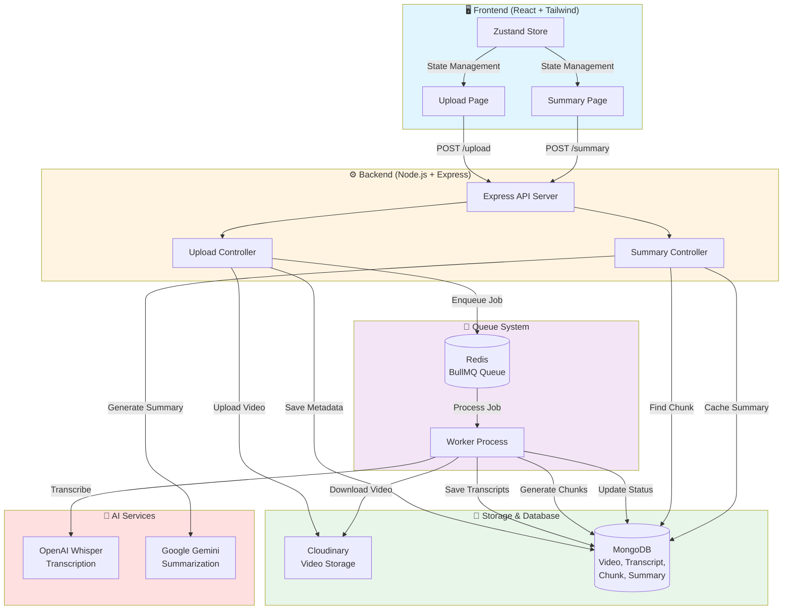
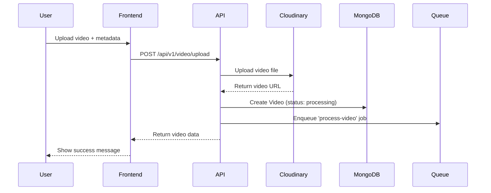
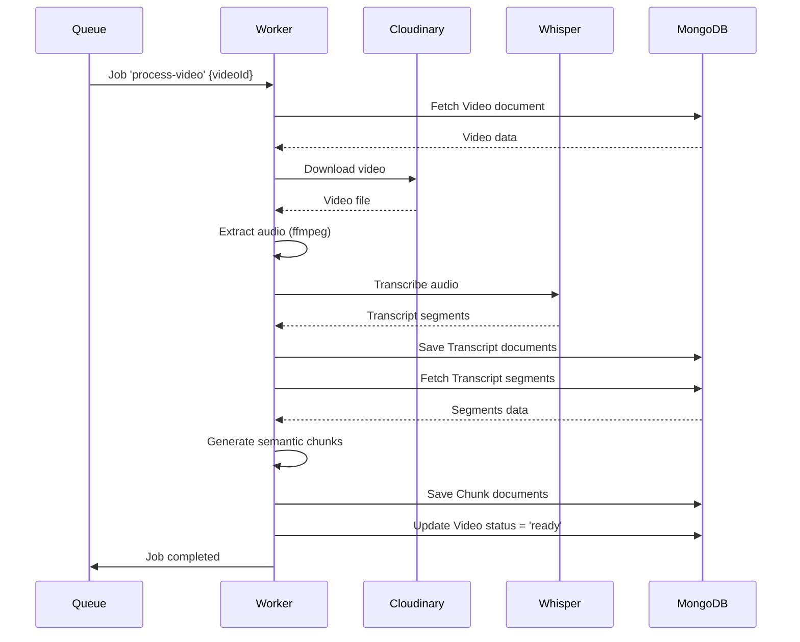
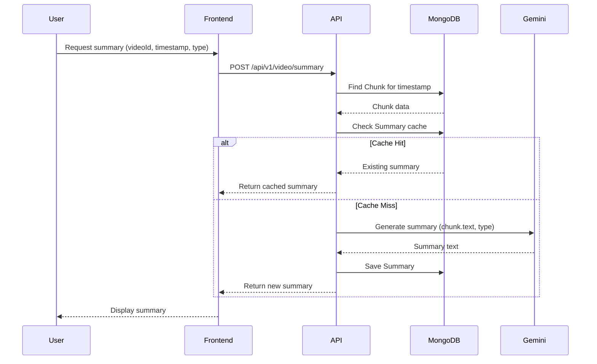

# 🎥 VideoChat - AI-Powered Video Processing Platform

<div align="center">


**Upload videos, generate transcripts, and get AI-powered summaries at any timestamp**

[Features](#-features) • [Quick Start](#-quick-start) • [Architecture](#-architecture) • [API Docs](#-api-documentation)

</div>

---

## ✨ Features

- 🎬 **Video Upload** - Upload videos to Cloudinary with metadata
- 🎤 **Automatic Transcription** - OpenAI Whisper API for accurate transcript generation
- 📝 **Semantic Chunking** - Intelligent text segmentation (80-140 words per chunk)
- 🤖 **AI Summaries** - Google Gemini-powered summaries (short/medium/detailed)
- ⚡ **Background Processing** - BullMQ queue system for async video processing
- 💾 **Smart Caching** - Summary caching to reduce API calls
- 🎨 **Modern UI** - Beautiful React + Tailwind CSS interface

---

## 🏗️ Architecture

### System Overview



---

## 📊 Data Flow

### 1️⃣ Video Upload Flow



### 2️⃣ Background Processing Flow



### 3️⃣ Summary Generation Flow



---

## 🚀 Quick Start

### Prerequisites

- **Node.js** v18+ 
- **MongoDB** (local or Atlas)
- **Redis** (for BullMQ)
- **FFmpeg** (for audio extraction)
- **API Keys**: OpenAI, Google Gemini, Cloudinary

### Installation

```bash
# Clone the repository
git clone <your-repo-url>
cd VideoChat

# Install server dependencies
cd server
npm install

# Install client dependencies
cd ../client
npm install
```

### Environment Setup

**Server** (`server/.env`):
```env
# MongoDB
MONGODB_URI=mongodb://localhost:27017/videochat

# Redis
REDIS_HOST=127.0.0.1
REDIS_PORT=6379

# Cloudinary
CLOUDDINARY_CLOUD_NAME=your_cloud_name
CLOUDDINARY_API_KEY=your_api_key
CLOUDDINARY_API_SECRET=your_api_secret

# OpenAI (Whisper)
OPENAI_API_KEY=your_openai_key

# Google Gemini
GOOGLE_GENERATIVE_AI_API_KEY=your_google_key

# Optional
PORT=3000
CLEAN_QUEUE_ON_STARTUP=false
```

**Client** (`client/.env`):
```env
VITE_API_URL=http://localhost:3000/api/v1/video
```

### Running the Application

You need **3 terminal windows**:

**Terminal 1 - Server:**
```bash
cd server
npm run dev
```

**Terminal 2 - Worker:**
```bash
cd server
npm run worker
```

**Terminal 3 - Client:**
```bash
cd client
npm run dev
```

### Verify Installation

```bash
# Check FFmpeg
cd server
npm run check-ffmpeg

# Check MongoDB connection (should see "Connected to MongoDB")
# Check Redis (should see worker connected)
```

---

## 📁 Project Structure

```
VideoChat/
├── server/                    # Backend (Node.js + Express)
│   ├── controllers/          # API controllers
│   │   ├── video.controller.js
│   │   ├── transcript.controller.js
│   │   ├── chunk.controller.js
│   │   └── summary.controller.js
│   ├── modals/               # Mongoose models
│   │   ├── video.modal.js
│   │   ├── transcript.modal.js
│   │   ├── chunk.modal.js
│   │   └── summery.modal.js
│   ├── routes/               # Express routes
│   │   └── video.routes.js
│   ├── queue/                # BullMQ queue
│   │   └── video.queue.js
│   ├── workers/              # Background workers
│   │   └── video.worker.js
│   ├── lib/                  # Utilities
│   │   ├── db.js
│   │   ├── cloudinary.js
│   │   └── multer.js
│   ├── scripts/              # Utility scripts
│   │   └── reset-queue.js
│   └── index.js              # Server entry point
│
└── client/                    # Frontend (React + Vite)
    ├── src/
    │   ├── pages/            # React pages
    │   │   ├── UploadPage.jsx
    │   │   └── SummaryPage.jsx
    │   ├── components/       # React components
    │   ├── store/            # Zustand stores
    │   │   └── useVideoStore.js
    │   ├── api/              # API client
    │   │   └── videoApi.js
    │   └── App.jsx
    └── package.json
```

---

## 🔌 API Documentation

### Upload Video

**Endpoint:** `POST /api/v1/video/upload`

**Request:**
```javascript
FormData {
  file: File,           // Video file
  title: string,       // Video title
  description: string,  // Optional description
  duration: number     // Duration in seconds
}
```

**Response:**
```json
{
  "message": "Video uploaded successfully. Processing has started.",
  "data": {
    "_id": "video_id",
    "title": "Video Title",
    "description": "Description",
    "videoUrl": "https://cloudinary.com/...",
    "duration": 120,
    "status": "processing"
  }
}
```

### Get Video Status

**Endpoint:** `GET /api/v1/video/:videoId`

**Response:**
```json
{
  "message": "Video retrieved successfully",
  "data": {
    "_id": "video_id",
    "title": "Video Title",
    "status": "ready",  // processing | ready | failed
    "videoUrl": "https://...",
    "duration": 120
  }
}
```

### Generate Summary

**Endpoint:** `POST /api/v1/video/summary`

**Request:**
```json
{
  "videoId": "video_id",
  "timestamp": 45.5,    // Time in seconds
  "type": "medium"      // short | medium | detailed
}
```

**Response:**
```json
{
  "message": "Summary generated successfully",
  "data": {
    "chunkId": "chunk_id",
    "type": "medium",
    "summary": "Generated summary text..."
  }
}
```

---

## 🛠️ Available Scripts

### Server Scripts

```bash
npm run dev          # Start server with nodemon
npm start            # Start server (production)
npm run worker       # Start worker process
npm run dev:worker   # Start worker with nodemon
npm run reset-queue  # Reset/clear queue
npm run check-ffmpeg # Verify FFmpeg installation
```

### Client Scripts

```bash
npm run dev          # Start dev server
npm run build        # Build for production
npm run preview      # Preview production build
```

---

## 🔄 Queue Management

### Reset Queue

If jobs get stuck, reset the queue:

```bash
cd server
npm run reset-queue
```

### Auto-clean on Startup

Add to `server/.env`:
```env
CLEAN_QUEUE_ON_STARTUP=true
```

### Queue Statistics

The reset script shows:
- Waiting jobs
- Active jobs
- Completed jobs
- Failed jobs

---

## 🎯 Processing Pipeline

### Step-by-Step Processing

1. **Upload** → Video uploaded to Cloudinary
2. **Queue** → Job added to BullMQ queue
3. **Download** → Worker downloads video from Cloudinary
4. **Extract Audio** → FFmpeg extracts audio track
5. **Transcribe** → OpenAI Whisper generates transcript segments
6. **Chunk** → Semantic chunking (80-140 words, topic detection)
7. **Store** → Transcripts and chunks saved to MongoDB
8. **Ready** → Video status updated to "ready"

### Chunking Logic

Chunks are created based on:
- **Word Count**: 80-140 words per chunk
- **Pauses**: Split on pauses > 2 seconds
- **Topic Changes**: Phrases like "next", "moving on", "now let's"
- **Sentence Endings**: Natural breaks at periods/exclamation marks

---

## 🐛 Troubleshooting

### Common Issues

**FFmpeg Not Found**
```bash
# Check installation
npm run check-ffmpeg

# Install on Windows
winget install ffmpeg
# or
choco install ffmpeg
```

**MongoDB Connection Error**
- Verify MongoDB is running
- Check `MONGODB_URI` in `.env`
- Ensure connection string is correct

**Redis Connection Error**
- Verify Redis is running: `redis-cli ping`
- Check `REDIS_HOST` and `REDIS_PORT` in `.env`

**Worker Not Processing Jobs**
- Ensure worker is running in separate terminal
- Check Redis connection
- Verify MongoDB connection in worker
- Check worker logs for errors

**Queue Jobs Stuck**
```bash
# Reset the queue
npm run reset-queue
```

---

## 📊 Database Models

### Video
```javascript
{
  title: String,
  description: String,
  videoUrl: String,
  duration: Number,
  status: "processing" | "ready" | "failed",
  createdAt: Date,
  updatedAt: Date
}
```

### Transcript
```javascript
{
  videoId: ObjectId,
  start: Number,    // seconds
  end: Number,      // seconds
  text: String,
  createdAt: Date
}
```

### Chunk
```javascript
{
  videoId: ObjectId,
  start: Number,    // seconds
  end: Number,      // seconds
  text: String,
  createdAt: Date
}
```

### Summary
```javascript
{
  chunkId: ObjectId,
  type: "short" | "medium" | "detailed",
  summaryText: String,
  createdAt: Date
}
```

---

## 🔐 Environment Variables Reference

| Variable | Description | Required | Default |
|----------|-------------|----------|---------|
| `MONGODB_URI` | MongoDB connection string | ✅ | - |
| `REDIS_HOST` | Redis host | ❌ | `127.0.0.1` |
| `REDIS_PORT` | Redis port | ❌ | `6379` |
| `REDIS_PASSWORD` | Redis password | ❌ | - |
| `CLOUDDINARY_CLOUD_NAME` | Cloudinary cloud name | ✅ | - |
| `CLOUDDINARY_API_KEY` | Cloudinary API key | ✅ | - |
| `CLOUDDINARY_API_SECRET` | Cloudinary API secret | ✅ | - |
| `OPENAI_API_KEY` | OpenAI API key (Whisper) | ✅ | - |
| `GOOGLE_GENERATIVE_AI_API_KEY` | Google Gemini API key | ✅ | - |
| `PORT` | Server port | ❌ | `3000` |
| `CLEAN_QUEUE_ON_STARTUP` | Auto-clean queue | ❌ | `false` |
| `VITE_API_URL` | API base URL (client) | ❌ | `http://localhost:3000/api/v1/video` |

---

## 🎨 Tech Stack

### Backend
- **Node.js** - Runtime environment
- **Express** - Web framework
- **MongoDB** - Database
- **Mongoose** - ODM
- **BullMQ** - Queue system
- **Redis** - Queue storage
- **Cloudinary** - Video storage
- **Multer** - File upload handling
- **OpenAI** - Whisper transcription
- **Google Gemini** - AI summarization

### Frontend
- **React** - UI framework
- **Vite** - Build tool
- **Tailwind CSS** - Styling
- **Zustand** - State management
- **Axios** - HTTP client

---

## 📝 License

This project is licensed under the ISC License.

---

## 🤝 Contributing

Contributions are welcome! Please feel free to submit a Pull Request.

---

## 📧 Support

For issues and questions, please open an issue on GitHub.

---

<div align="center">

**Made with ❤️ using Node.js, React, and AI**

[⬆ Back to Top](#-videochat---ai-powered-video-processing-platform)

</div>
